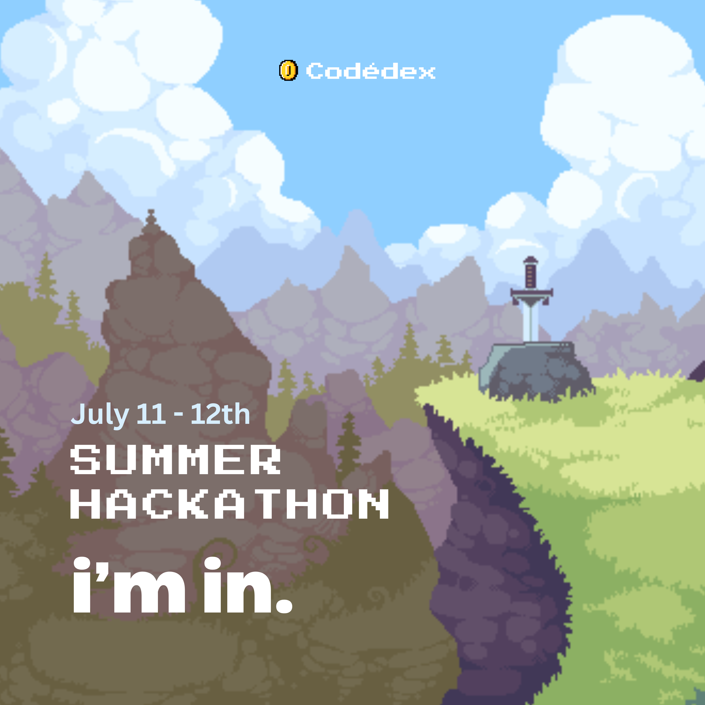

# Nassim Cherfaoui - Développeur Web Full-Stack 🚀

Bienvenue ! Je suis Nassim, un développeur web passionné basé en Bretagne. Plongez dans mon univers où la technologie et l'innovation se rencontrent !

### 🌐 À Propos de Moi
👨‍💻 Actuellement en formation de Concepteur Développeur d'Applications Java à Brest.  
🚀 Futur Stagiaire chez Arkéa à partir de novembre 2024.    
🌱 Toujours à la recherche de nouvelles technologies à explorer et de défis à relever.  
🎉 **Participant au SUMMER HACKATHON July 11-12th, 2024** organisé par Codédex. Plus d'infos [ici](https://www.codedex.io/hackathon).  
<!--  -->
<!--   -->
<!--  -->

### 💼 Compétences Clés

#### Langages et Frameworks
- **Langages** : Java, HTML, CSS, JavaScript, PHP
- **Frameworks** : Spring Boot, React Native, Vue.js, Symfony, Bootstrap, jQuery

#### Outils de Développement
- **Docker, Kubernetes** : Conteneurisation et Orchestration
- **Git, GitHub** : Gestion de Version
- **CI/CD** : Intégration continue et déploiement continu

#### Autres Compétences
- Programmation orientée objet (POO)
- Conception pour WordPress
- Bases de données SQL et NoSQL
- Node.js
- Design web responsive

### 📫 Comment Me Contacter
     

### ⚡ Citation Préférée

"La seule façon de faire du bon travail est d’aimer ce que vous faites." - Steve Jobs

<!-- my-badges start -->

<!-- my-badges end -->

Merci d'avoir visité mon espace ! Explorez mes projets et n'hésitez pas à me contacter. Ensemble, repoussons les limites du possible 🚀🌌.

